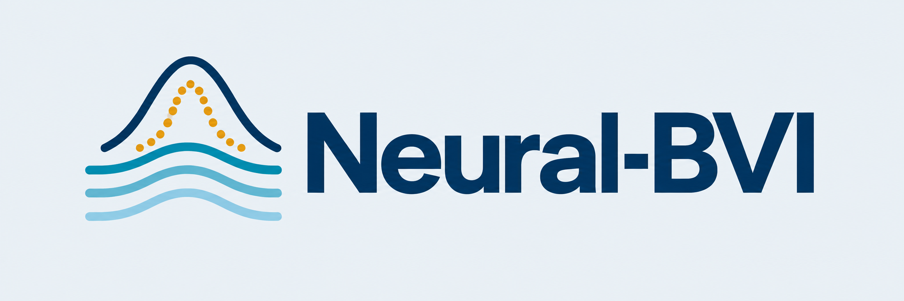
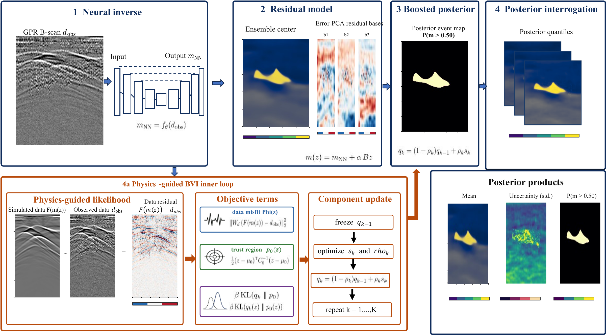
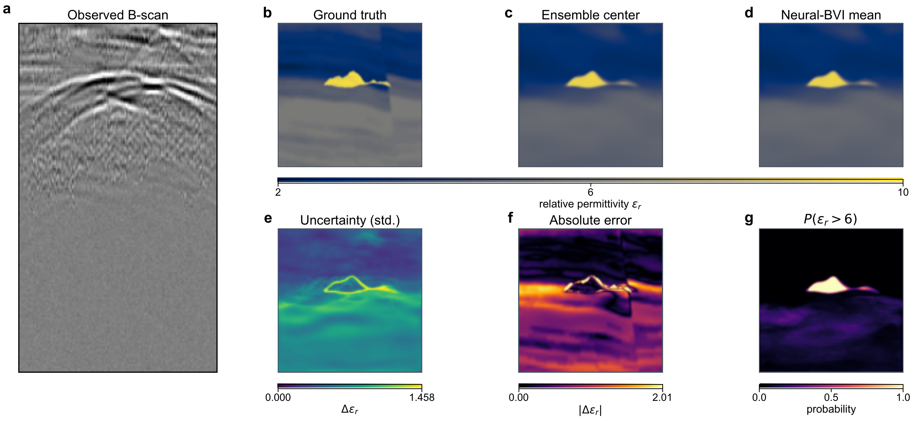
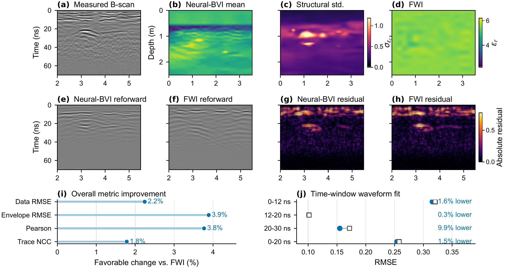

<p align="center">
  
</p>

**Neural initialization and physics-conditioned boosting variational inference for ground-penetrating radar inversion.**

Research code for *Neural-BVI: End-to-End Ground-Penetrating Radar Inversion With Boosting Variational Inference*, by Xintong Liu, Qiyang Pi, and Yonghao Wang.

Neural-BVI starts from a trained neural reconstruction and estimates a residual posterior using a differentiable forward model. It produces a permittivity reconstruction, spatial uncertainty, and high-permittivity event probabilities. The paper configuration additionally uses a calibrated five-network center, predictive dispersion augmentation, and a fixed physics-based mean-selection rule. See [Method](docs/method.md) for these details.

**Start here:** [Installation](docs/installation.md) · [Reproduce the paper](docs/reproducibility.md) · [Data and weights](docs/data_and_models.md) · [Contribute](CONTRIBUTING.md)

License: [Apache-2.0](LICENSE) · [中文](README.zh-CN.md) · [Citation](CITATION.cff)

## Highlights

- Neural initialization followed by differentiable physics-conditioned posterior inference.
- Best mean Image NRMSE, Data RMSE and CRPS among the six methods in the reported test experiment.
- Reconstruction, spatial uncertainty and high-permittivity event probability maps.
- A self-contained CPU example, reproducible evaluation settings and Linux/Windows tests.

## Framework



**Figure 1 — Neural-BVI framework.** A neural ensemble provides the initial permittivity center. Physics-guided boosting variational inference updates a low-dimensional residual posterior, while a model-space prior limits departures from the neural estimate. Posterior samples yield reconstruction, uncertainty and target-event probability maps.

## Quick start

Python 3.11 is the locally tested interpreter. Install the CPU or CUDA build of PyTorch appropriate for your machine, then:

```bash
git clone https://github.com/Bilybill/Neural-BVI.git
cd Neural-BVI
python -m venv .venv
# Linux/macOS: source .venv/bin/activate
# Windows PowerShell: .venv\Scripts\Activate.ps1
python -m pip install --upgrade pip
python -m pip install -e ".[dev]"
python -m neural_bvi doctor
python -m neural_bvi demo --output outputs/demo
```

The demo generates procedural models, simulates scalar-wave B-scans, trains a small inverse network, checks the likelihood gradient, and runs two-component BVI on a held-out model. It needs no downloaded data or trained weights and defaults to CPU. Outputs include `summary.json`, `posterior.npz`, `inverse_weights.pt`, and `reconstruction.png`. The demo demonstrates the computational chain; its grid, network and Gaussian noise differ from the paper experiment.

## Reported synthetic results

These are archived results on **20 held-out models × 3 noise levels (0/5/10 dB)**, not measurements from the quick-start demo. Smaller values are preferred in the three columns below.

| Method | Image NRMSE | Data RMSE | Empirical CRPS |
| :--- | ---: | ---: | ---: |
| Neural inverse | 0.085099 | 0.161379 | — |
| MC dropout | 0.085025 | 0.160910 | 0.054172 |
| Deep ensemble | 0.081656 | 0.149867 | 0.049518 |
| Residual MAP | 0.085549 | 0.158306 | — |
| Residual Laplace | 0.085538 | 0.159304 | 0.045780 |
| Neural-BVI | **0.081249** | **0.147943** | **0.042392** |



**Figure 2 — Synthetic reconstruction and posterior characterization at 5 dB.** (a) Observed B-scan; (b) ground truth; (c) calibrated ensemble center; (d) Neural-BVI posterior mean; (e) validation-scaled posterior standard deviation; (f) absolute reconstruction error; (g) high-permittivity probability $P(\epsilon_r>6)$. This is the paper's held-out example, not the quick-start demo.

Full precision, dispersion, calibrated coverage, spatial error ranking, and model-clustered comparisons are available in [the results directory](results/paper). Recompute the table from the released per-record metrics with:

```bash
python scripts/verify_results.py
```

The forward model is a Deepwave scalar-wave approximation. These results do not establish robustness to electromagnetic model mismatch. The public source contains the inference and training pipeline; exact numerical replay also needs the original data and checkpoints listed in [Data and weights](docs/data_and_models.md). They are not bundled in this source release.

## Field-data results



**Figure 3 — Measured-data comparison with full-waveform inversion (FWI).** (a) Measured B-scan; (b–d) Neural-BVI mean, structural standard deviation and FWI reconstruction; (e–h) reforwarded responses and absolute residuals; (i) relative metric improvements; (j) time-window RMSE comparisons. In this record, Neural-BVI reduces source-corrected RMSE from 0.1602 to 0.1566 and envelope RMSE from 0.1946 to 0.1870, while providing spatially resolved structural uncertainty.

Figures 1–3 reproduce the paper figures. See [visual assets](docs/assets/README.md) for descriptions. Raw field recordings are not distributed; the source release provides the synthetic training/evaluation workflow and procedural example.

## Repository layout

```text
src/neural_bvi/          Installable API, CLI, procedural demo
experiments/bvi_e2e/     Numerical kernels and synthetic training/evaluation scripts
configs/paper/          Frozen settings and small synthetic calibration assets
results/paper/          Archived per-record metrics and aggregate results
scripts/                Paper runner, artifact checks, result verification, packaging
tests/                  Gradient, sampling, metrics and configuration tests
docs/                   Method, reproduction, artifact and contributor guidance
.github/                CI and issue/PR templates
```

Use the CLI for the self-contained demo and the repository scripts for paper evaluation. The test-model identities are defined in `configs/paper/test_set.json`.

## Reproduction and development

```bash
python -m pytest
python -m ruff check src tests scripts
python scripts/check_repository.py
python scripts/run_paper.py --artifact-root artifacts/paper --dry-run
```

There are three distinct checks: procedural execution, re-aggregation of archived metrics, and full data-to-results reproduction. [Reproducibility](docs/reproducibility.md) records what each verifies and the external inputs needed for the last one. CI runs the first two without private data; a passing CI badge should not be interpreted as a re-run of the complete paper benchmark.

Distribution contents are explicitly listed in `RELEASE_FILES.txt`; source archives do not collect arbitrary files from the working directory.

## Citation and acknowledgments

Use [CITATION.cff](CITATION.cff) for software attribution. A publication DOI will be added after one exists. Deepwave, PyTorch, NumPy, SciPy, Matplotlib and scikit-image remain separately licensed dependencies; see [third-party notices](THIRD_PARTY_NOTICES.md).

This research was funded by the National Natural Science Foundation of China (grant no. 42304160) and the Jilin Scientific and Technological Development Program (no. YDZJ202501ZYTS544).

Corresponding author: Yonghao Wang, Hunan University, yonghao2025@hnu.edu.cn.
